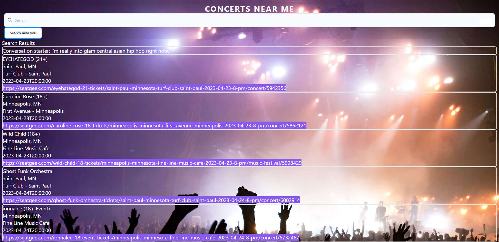

# Concerts Near Me

Concerts Near Me is a dynamic web-server to find concerts venues for artists near by that you enjoy. 
It will show you time, location, and date of the concert. 

## User Story:
* AS a music lover looking for a concert venues near by.
* I WANT to be able easily search for concerts happening in my area.
* SO THAT I may find desired music event within a convenient time, date and location.

## API'S:
* Seatgeek- Directory of live concerts venues.  
* GENRENATOR- Directory of genre's 

## Application Requirments:
* Use at least two server-side API's.
* Must be responsive.
* Have a polished UI.
* Use a CSS framework other than Bootstrap.
* Be deployed to GitHub Pages.
* Must be interactive (i.e: accept and respond to user input)

## Screenshot

## Installation:
* GitHub: https://github.com/Jrorem/concerts-near-me
* Link to web application:

## The Creators:
* Joe Rorem
* August Moehring
* Mohamed Hashim 
* Oleg Sayenko

